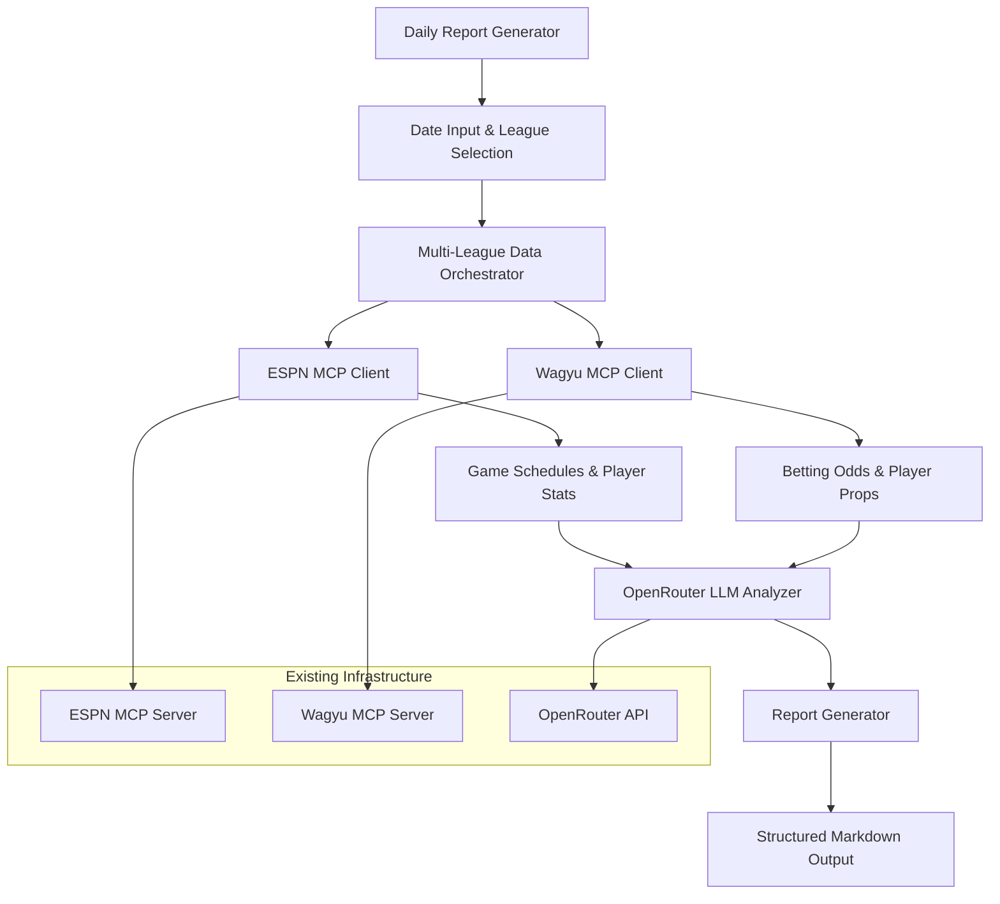

# Design Document

## Overview

The Daily Betting Intelligence Report system extends the existing MCP-based sports data platform to automatically generate comprehensive daily betting analysis reports. The system leverages the proven ESPN MCP Server for sports data, Wagyu MCP Server for betting odds, and OpenRouter LLM integration to create structured markdown reports containing game analysis, betting recommendations, and player prop insights for all games on a specified date.

The design builds directly on the existing architecture without requiring new data sources or major structural changes, ensuring rapid implementation and reliable operation.

## Architecture

### High-Level System Flow



### Component Integration

The system integrates with existing components:

- **ESPN MCP Server** (`mcp/sports_ai_mcp.py`) - Game schedules, team data, player statistics
- **Wagyu MCP Server** (`mcp/wagyu_sports/mcp_server/odds_client_server.py`) - Betting odds and player props
- **Core MCP Client** (`clients/core_mcp.py`) - ESPN data access wrapper
- **Wagyu Client** (`clients/wagyu_client.py`) - Betting odds access wrapper
- **OpenRouter LLM** (`clients/core_llm.py`) - Analysis and prediction generation

## Components and Interfaces

### 1. Daily Report Generator (Main Entry Point)

**File:** `daily_betting_report.py`

**Purpose:** Main orchestrator that coordinates data fetching, analysis, and report generation.

**Key Methods:**
```python
async def generate_daily_report(
    target_date: str,
    leagues: List[str] = None,
    markets: List[str] = None,
    output_format: str = "markdown"
) -> Dict[str, Any]

async def save_report(report_data: Dict[str, Any], filename: str = None) -> str
```

**Responsibilities:**
- Parse and validate input parameters
- Coordinate multi-league data fetching
- Orchestrate LLM analysis workflow
- Generate final structured report
- Handle error aggregation and reporting

### 2. Multi-League Data Orchestrator

**File:** `data_orchestrator.py`

**Purpose:** Manages concurrent data fetching across multiple sports leagues while respecting API rate limits.

**Key Methods:**
```python
async def fetch_all_leagues_data(
    target_date: str,
    leagues: List[str]
) -> Dict[str, Dict[str, Any]]

async def fetch_league_data(
    league: str,
    target_date: str
) -> Dict[str, Any]
```

**Features:**
- Concurrent API calls with rate limiting
- Timeout protection for slow MCP servers
- Error isolation per league
- Eastern timezone handling

### 3. Game Analysis Engine

**File:** `game_analyzer.py`

**Purpose:** Uses OpenRouter LLM to analyze games and identify key players and betting opportunities.

**Key Methods:**
```python
async def analyze_game_matchup(
    game_data: Dict[str, Any],
    odds_data: Dict[str, Any]
) -> Dict[str, Any]

async def identify_key_players(
    game_data: Dict[str, Any],
    team_stats: Dict[str, Any]
) -> List[Dict[str, Any]]

async def generate_betting_recommendations(
    game_data: Dict[str, Any],
    odds_data: Dict[str, Any]
) -> Dict[str, Any]
```

**Analysis Framework:**
- Fact-based analysis using provided JSON data only
- Confidence scoring for predictions
- Value bet identification
- Player performance projections

### 4. Report Formatter

**File:** `report_formatter.py`

**Purpose:** Generates structured markdown reports with consistent formatting across all sports.

**Key Methods:**
```python
def format_daily_report(
    date: str,
    league_data: Dict[str, Any],
    analysis_results: Dict[str, Any]
) -> str

def format_game_section(
    game: Dict[str, Any],
    odds: Dict[str, Any],
    analysis: Dict[str, Any]
) -> str
```

**Output Structure:**
```markdown
# Daily Betting Intelligence Report - [DATE]

## Executive Summary
- Total games analyzed: X
- Leagues covered: [LIST]
- High-confidence recommendations: X

## [SPORT] Analysis

### [Team A] @ [Team B] - [TIME] ET

#### Game Overview
- Venue, weather, key matchup factors

#### Betting Lines
- Moneyline: Best odds across sportsbooks
- Spread: Point spread with best prices
- Total: Over/under with recommendations

#### Key Players & Props
- Player 1: [Analysis] - Props available
- Player 2: [Analysis] - Props available

#### Predictions & Recommendations
- Outcome prediction with confidence
- Value bets identified
- Risk assessment
```

### 5. Configuration Manager

**File:** `config_manager.py`

**Purpose:** Manages system configuration, league mappings, and market selections.

**Configuration Structure:**
```python
DEFAULT_CONFIG = {
    "leagues": ["nfl", "nba", "wnba", "mlb", "nhl", "mls", "epl", "laliga", "ncaaf", "ncaab"],
    "betting_markets": ["h2h", "spreads", "totals"],
    "player_prop_markets": ["player_points", "player_rebounds", "player_assists"],
    "timezone": "US/Eastern",
    "timeout_seconds": 30,
    "max_concurrent_requests": 5,
    "confidence_threshold": 0.7
}
```

## Data Models

### Game Data Model
```python
@dataclass
class GameData:
    event_id: str
    league: str
    home_team: str
    away_team: str
    game_time: datetime
    venue: str
    status: str  # pre-game, live, final
    home_score: Optional[int] = None
    away_score: Optional[int] = None
    
@dataclass
class TeamStats:
    team_name: str
    recent_performance: Dict[str, Any]
    key_players: List[str]
    injuries: List[str]
```

### Betting Data Model
```python
@dataclass
class BettingOdds:
    event_id: str
    sportsbook: str
    moneyline_home: Optional[int]
    moneyline_away: Optional[int]
    spread_line: Optional[float]
    spread_home_odds: Optional[int]
    spread_away_odds: Optional[int]
    total_line: Optional[float]
    total_over_odds: Optional[int]
    total_under_odds: Optional[int]
    last_updated: datetime

@dataclass
class PlayerProp:
    player_name: str
    prop_type: str  # points, rebounds, assists
    line: float
    over_odds: int
    under_odds: int
    sportsbook: str
```

### Analysis Data Model
```python
@dataclass
class GameAnalysis:
    event_id: str
    predicted_winner: str
    confidence_score: float
    key_factors: List[str]
    value_bets: List[Dict[str, Any]]
    risk_level: str  # low, medium, high
    
@dataclass
class PlayerAnalysis:
    player_name: str
    projected_stats: Dict[str, float]
    confidence_score: float
    prop_recommendations: List[Dict[str, Any]]
    reasoning: str
```

## Error Handling

### Error Categories and Responses

1. **MCP Server Errors**
   - ESPN server unavailable → Skip affected leagues, note in report
   - Wagyu server timeout → Include games without odds, note limitation
   - Partial data retrieval → Process available data, flag incomplete sections

2. **Data Quality Issues**
   - Missing game data → Skip game, log issue
   - Incomplete odds data → Note which markets unavailable
   - Player data missing → Skip player analysis for that game

3. **LLM Analysis Errors**
   - OpenRouter timeout → Use fallback analysis templates
   - Invalid LLM response → Retry with simplified prompt
   - Rate limit exceeded → Queue analysis requests

4. **System-Level Errors**
   - Invalid date format → Return clear error message
   - Unsupported league → Filter out, continue with supported leagues
   - Configuration errors → Use default values, log warnings

### Error Recovery Strategies

```python
class ErrorHandler:
    async def handle_mcp_error(self, error: MCPError, context: str) -> Dict[str, Any]:
        """Handle MCP server errors with graceful degradation."""
        
    async def handle_llm_error(self, error: LLMError, retry_count: int) -> Dict[str, Any]:
        """Handle LLM errors with retry logic."""
        
    def aggregate_errors(self, errors: List[Exception]) -> Dict[str, Any]:
        """Aggregate errors for final report summary."""
```

## Testing Strategy

### Unit Testing

1. **Component Testing**
   - Data orchestrator with mock MCP responses
   - Game analyzer with sample JSON data
   - Report formatter with various data scenarios
   - Error handler with different error types

2. **Integration Testing**
   - End-to-end report generation with test date
   - MCP server connectivity validation
   - LLM integration with sample prompts
   - Multi-league concurrent processing

3. **Data Validation Testing**
   - Timezone conversion accuracy
   - Odds data parsing and formatting
   - Player prop data extraction
   - Report structure validation

### Test Data Strategy

```python
# Test fixtures for different scenarios
TEST_SCENARIOS = {
    "single_sport_day": {
        "date": "20250809",
        "leagues": ["wnba"],
        "expected_games": 3
    },
    "multi_sport_day": {
        "date": "20250810", 
        "leagues": ["nfl", "nba", "mlb"],
        "expected_games": 15
    },
    "no_games_day": {
        "date": "20250601",
        "leagues": ["nfl"],
        "expected_games": 0
    }
}
```

### Performance Testing

1. **Load Testing**
   - Multiple concurrent report generations
   - Large multi-sport days (15+ games)
   - API rate limit boundary testing

2. **Timeout Testing**
   - MCP server response delays
   - LLM analysis timeouts
   - Network connectivity issues

## Implementation Phases

### Phase 1: Core Infrastructure (Tasks 1-4)
- Set up project structure and interfaces
- Implement data orchestrator with ESPN MCP integration
- Create basic report formatter
- Add comprehensive error handling

**Deliverable:** Single-sport daily report generation (WNBA)

### Phase 2: Betting Integration (Tasks 5-8)
- Integrate Wagyu MCP client for odds data
- Implement best odds identification across sportsbooks
- Add player props data fetching
- Create betting analysis templates

**Deliverable:** Complete betting analysis for single sport

### Phase 3: LLM Analysis Engine (Tasks 9-12)
- Implement OpenRouter LLM integration for game analysis
- Create key player identification system
- Build betting recommendation engine
- Add confidence scoring and value bet detection

**Deliverable:** AI-powered analysis and recommendations

### Phase 4: Multi-Sport Expansion (Tasks 13-16)
- Extend to all supported leagues
- Implement concurrent processing with rate limiting
- Add sport-specific analysis adaptations
- Optimize performance for large report days

**Deliverable:** Full multi-sport daily intelligence reports

### Phase 5: Polish and Automation (Tasks 17-20)
- Add command-line interface with configuration options
- Implement report export and formatting options
- Create automated scheduling capabilities
- Add comprehensive logging and monitoring

**Deliverable:** Production-ready automated system

## Performance Considerations

### API Rate Limiting
- ESPN MCP: No explicit limits, but implement 2-second delays between calls
- Wagyu MCP: Respects The Odds API rate limits (500 requests/month)
- OpenRouter: Implement exponential backoff for rate limit responses

### Concurrent Processing
- Maximum 5 concurrent MCP calls to prevent server overload
- Process leagues sequentially, games within leagues concurrently
- Implement timeout protection (30 seconds per operation)

### Memory Management
- Stream large datasets rather than loading all in memory
- Clear intermediate data structures after processing
- Implement garbage collection hints for large report days

### Caching Strategy
- Cache team rosters and static data for 24 hours
- Cache odds data for 5 minutes to balance freshness and API usage
- Implement intelligent cache invalidation based on game status

## Security and Configuration

### Environment Variables
```bash
# Required for existing MCP servers
OPENROUTER_API_KEY=sk-or-v1-...
ODDS_API_KEY=...

# Optional configuration
REPORT_OUTPUT_DIR=./reports
MAX_CONCURRENT_REQUESTS=5
DEFAULT_TIMEZONE=US/Eastern
```

### Configuration Validation
- Validate API keys on startup
- Check MCP server connectivity before processing
- Verify timezone configuration
- Validate date format and range

This design leverages the existing proven MCP architecture while adding the new daily intelligence capabilities in a modular, testable way. The system can be implemented incrementally, starting with single-sport reports and expanding to full multi-sport automation.