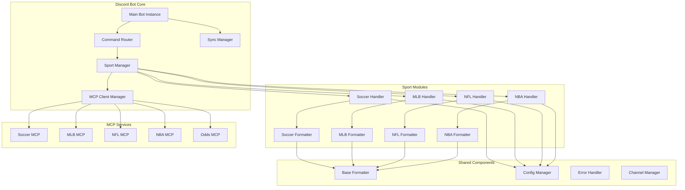

# Design Document

## Overview

This design transforms the current monolithic Discord bot into a modular, scalable architecture that supports multiple sports with consistent formatting, reliable command synchronization, and maintainable code structure. The solution addresses the current issues of messy output formatting, manual Discord restarts, and difficulty adding new sports.

## Architecture

### High-Level Architecture



### Component Breakdown

#### 1. Core Bot Components

**Main Bot Instance (`sports_bot.py`)**
- Minimal Discord.py bot setup
- Registers sport modules dynamically
- Handles global commands (sync, help, status)
- Manages bot lifecycle events

**Command Router (`command_router.py`)**
- Routes sport-specific commands to appropriate handlers
- Validates permissions and parameters
- Provides consistent error handling

**Sport Manager (`sport_manager.py`)**
- Dynamically loads sport modules
- Provides unified interface for sport operations
- Manages sport-specific configurations

**MCP Client Manager (`mcp_client.py`)**
- Unified HTTP client for all MCP services
- Connection pooling and retry logic
- Standardized error handling and logging

**Sync Manager (`sync_manager.py`)**
- Handles Discord command synchronization
- Provides detailed sync feedback
- Manages sync permissions and validation

#### 2. Sport Module Architecture

Each sport follows a consistent interface pattern:

**Sport Handler Interface**
```python
class BaseSportHandler:
    def __init__(self, config: SportConfig, mcp_client: MCPClient):
        pass
    
    async def create_channels(self, interaction, date: str) -> ChannelCreationResult:
        pass
    
    async def clear_channels(self, interaction, category_name: str) -> ClearResult:
        pass
    
    async def get_matches(self, date: str) -> List[Match]:
        pass
    
    async def format_match_analysis(self, match: Match) -> discord.Embed:
        pass
```

**Sport-Specific Implementations**
- `SoccerHandler`: Handles soccer-specific logic and MCP calls
- `MLBHandler`: Handles baseball-specific logic and MCP calls
- `NFLHandler`: Handles football-specific logic and MCP calls
- `NBAHandler`: Handles basketball-specific logic and MCP calls

#### 3. Formatting System

**Base Formatter (`formatters/base_formatter.py`)**
- Common Discord embed utilities
- Standardized color schemes and styling
- Reusable formatting functions (odds conversion, date formatting, etc.)

**Sport-Specific Formatters**
- Inherit from BaseFormatter
- Implement sport-specific data presentation
- Handle sport-specific emoji and styling

## Components and Interfaces

### 1. Configuration System

**Config Structure**
```yaml
# config/bot_config.yaml
discord:
  token: ${DISCORD_TOKEN}
  sync_permissions: ["manage_channels"]

sports:
  soccer:
    mcp_url: ${SOCCER_MCP_URL}
    category_name: "SOCCER GAMES"
    category_id: 1407474278374576178
    default_league_id: 297
    date_format: "DD-MM-YYYY"
  
  mlb:
    mcp_url: ${MLB_MCP_URL}
    category_name: "MLB GAMES"
    date_format: "YYYY-MM-DD"
  
  nfl:
    mcp_url: ${NFL_MCP_URL}
    category_name: "NFL GAMES"
    date_format: "YYYY-MM-DD"

formatting:
  embed_colors:
    soccer: 0x00ff00
    mlb: 0x0066cc
    nfl: 0xff6600
    nba: 0xcc0000
  
  max_channels_per_operation: 20
  channel_creation_delay: 1.0
```

### 2. Enhanced Message Formatting

**Improved Embed Structure**
```python
class MatchEmbed:
    def __init__(self, match_data: Dict, sport_config: SportConfig):
        self.embed = discord.Embed(
            title=self._format_title(match_data),
            description=self._format_description(match_data),
            color=sport_config.embed_color,
            timestamp=datetime.now()
        )
        
    def add_match_details(self):
        # Clean, organized match information
        
    def add_betting_odds(self):
        # Formatted odds with both decimal and American
        
    def add_team_analysis(self):
        # Recent form with visual indicators
        
    def add_head_to_head(self):
        # H2H stats with clear formatting
        
    def add_predictions(self):
        # AI predictions with confidence levels
```

**Formatting Improvements**
- Use Discord's embed fields for organized data presentation
- Implement consistent emoji usage across sports
- Add visual separators and proper spacing
- Use code blocks for statistical data alignment
- Implement progressive disclosure (summary → details)

### 3. Command Synchronization System

**Sync Manager Implementation**
```python
class SyncManager:
    def __init__(self, bot: commands.Bot):
        self.bot = bot
        
    async def sync_commands(self, interaction: discord.Interaction) -> SyncResult:
        # Validate permissions
        # Perform sync with detailed logging
        # Return comprehensive results
        
    async def validate_sync_permissions(self, user: discord.Member) -> bool:
        # Check user permissions
        
    async def get_sync_status(self) -> SyncStatus:
        # Return current sync state
```

### 4. Sport Module Registration

**Dynamic Sport Loading**
```python
class SportManager:
    def __init__(self):
        self.sports = {}
        self.load_sports()
    
    def load_sports(self):
        # Dynamically import sport modules
        # Register sport handlers
        # Validate sport configurations
        
    def get_sport_handler(self, sport_name: str) -> BaseSportHandler:
        # Return appropriate sport handler
        
    def register_sport_commands(self, bot: commands.Bot):
        # Register all sport-specific commands
```

## Data Models

### Core Data Models

```python
@dataclass
class Match:
    id: str
    home_team: Team
    away_team: Team
    league: League
    datetime: datetime
    odds: Optional[Odds]
    status: MatchStatus

@dataclass
class Team:
    id: str
    name: str
    short_name: str
    recent_form: List[MatchResult]
    
@dataclass
class Odds:
    home_win: float
    draw: Optional[float]
    away_win: float
    over_under: Optional[OverUnder]
    
@dataclass
class AnalysisResult:
    match: Match
    head_to_head: Optional[HeadToHeadStats]
    predictions: Optional[Predictions]
    betting_insights: List[BettingInsight]
```

### Configuration Models

```python
@dataclass
class SportConfig:
    name: str
    mcp_url: str
    category_name: str
    category_id: Optional[int]
    embed_color: int
    date_format: str
    default_league_id: Optional[int]

@dataclass
class BotConfig:
    discord_token: str
    sports: Dict[str, SportConfig]
    sync_permissions: List[str]
    formatting: FormattingConfig
```

## Error Handling

### Error Handling Strategy

**Layered Error Handling**
1. **MCP Level**: Handle API failures, timeouts, rate limits
2. **Sport Handler Level**: Handle sport-specific errors, data validation
3. **Bot Level**: Handle Discord API errors, permission issues
4. **User Level**: Provide clear, actionable error messages

**Error Response Templates**
```python
class ErrorHandler:
    @staticmethod
    def mcp_timeout_error(sport: str) -> discord.Embed:
        # User-friendly timeout message with retry suggestion
        
    @staticmethod
    def permission_error(required_permission: str) -> discord.Embed:
        # Clear permission requirement explanation
        
    @staticmethod
    def data_unavailable_error(sport: str, date: str) -> discord.Embed:
        # Helpful message with alternative suggestions
```

## Testing Strategy

### Testing Approach

**Unit Testing**
- Test each sport handler independently
- Mock MCP responses for consistent testing
- Test formatting functions with various data scenarios
- Validate configuration loading and validation

**Integration Testing**
- Test MCP client with real API endpoints
- Test Discord command registration and execution
- Test error handling across component boundaries
- Test sync functionality with Discord API

**End-to-End Testing**
- Test complete user workflows (create channels, view analysis)
- Test multi-sport scenarios
- Test error recovery and graceful degradation
- Performance testing with multiple concurrent operations

**Testing Tools**
- pytest for unit and integration tests
- pytest-asyncio for async testing
- unittest.mock for MCP mocking
- Custom Discord testing utilities

### Test Coverage Goals
- 90%+ coverage for core components
- 100% coverage for critical paths (sync, error handling)
- Integration tests for all sport handlers
- Performance benchmarks for channel creation operations

## Implementation Phases

### Phase 1: Core Architecture Refactor
- Extract base components from current monolithic bot
- Implement configuration system
- Create sport handler interface
- Implement sync manager

### Phase 2: Enhanced Formatting
- Redesign embed structure
- Implement improved formatting templates
- Add visual enhancements and emoji usage
- Test formatting across different data scenarios

### Phase 3: Multi-Sport Support
- Implement remaining sport handlers (NFL, NBA)
- Add sport-specific formatting
- Test cross-sport functionality
- Optimize performance for multiple sports

### Phase 4: Advanced Features
- Add configuration hot-reloading
- Implement advanced error recovery
- Add performance monitoring
- Create admin dashboard commands