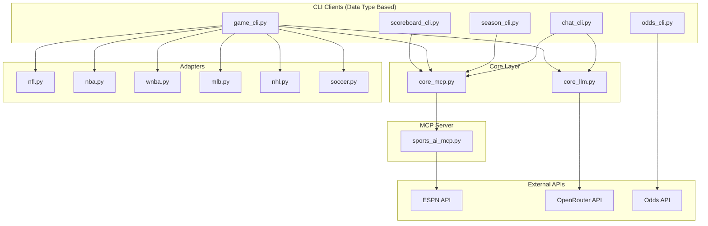

# Design Document

## Overview

This design implements a clean MCP-only client architecture organized by data type rather than sport. The system eliminates direct ESPN API calls from client code and ensures all data flows through the existing sports_ai_mcp.py server. The architecture separates concerns between data access (MCP), data formatting (adapters), LLM interactions (OpenRouter), and user interfaces (CLI clients).

## Architecture

### High-Level Architecture



### Directory Structure

```
/clients/
  core_mcp.py          # MCP wrapper functions
  core_llm.py          # OpenRouter integration
  scoreboard_cli.py    # Scoreboard data type client
  game_cli.py          # Game summary data type client
  season_cli.py        # Season stats data type client
  odds_cli.py          # Odds data type client
  chat_cli.py          # Natural language interface
/adapters/
  nfl.py              # NFL data normalization
  nba.py              # NBA data normalization
  wnba.py             # WNBA data normalization
  mlb.py              # MLB data normalization
  nhl.py              # NHL data normalization
  soccer.py           # Soccer data normalization
/tests/
  test_adapters_*.py  # Unit tests for adapters
  test_feature_*.py   # Integration tests for CLI clients
/mcp/
  sports_ai_mcp.py    # Existing MCP server (unchanged)
```

## Components and Interfaces

### Core MCP Wrapper (core_mcp.py)

**Purpose**: Provides a clean abstraction layer over the MCP server with league mapping and error handling.

**Key Functions**:
- `scoreboard(league, date=None, **kwargs)` → calls MCP getScoreboard
- `teams(league)` → calls MCP getTeams  
- `game_summary(league, event_id)` → calls MCP getGameSummary
- `analyze_game_strict(league, event_id, question)` → calls MCP analyzeGameStrict
- `probe_league_support(league, date=None)` → calls MCP probeLeagueSupport

**League Mapping**:
```python
LEAGUE_MAPPING = {
    'nfl': ('football', 'nfl'),
    'ncaaf': ('football', 'college-football'),
    'nba': ('basketball', 'nba'),
    'wnba': ('basketball', 'wnba'),
    'ncaab': ('basketball', 'mens-college-basketball'),
    'mlb': ('baseball', 'mlb'),
    'nhl': ('hockey', 'nhl'),
    'mls': ('soccer', 'usa.1'),
    'epl': ('soccer', 'eng.1'),
    'laliga': ('soccer', 'esp.1')
}
```

**Error Handling**: Graceful handling of MCP server errors, network issues, and invalid league codes.

### Core LLM Integration (core_llm.py)

**Purpose**: Provides strict OpenRouter integration that prevents fabrication and ensures responses are based only on provided JSON data.

**Key Function**:
- `strict_answer(payload, question)` → OpenRouter API call with strict system prompt

**Configuration**:
- Uses .env.local for OPENROUTER_API_KEY, OPENROUTER_BASE_URL, OPENROUTER_MODEL
- Low temperature (0.0-0.2) to prevent hallucination
- Max tokens ~700 for concise responses
- System prompt enforces "unavailable" responses for missing data

### CLI Clients (Data Type Based)

#### Scoreboard CLI (scoreboard_cli.py)
**Commands**:
- `events <league> [YYYYMMDD]` - List events for a date
- `--json` flag for raw MCP output
- `--pretty` flag for formatted table output (default)

**Output Format**:
```
EVENT_ID    | AWAY @ HOME           | STATUS    | DATE
401547439   | Ravens @ Colts        | Final     | 2024-08-15
401547440   | Chiefs @ Bills        | Pre-Game  | 2024-08-15
```

#### Game CLI (game_cli.py)
**Commands**:
- `game <league> <event_id> [--json] [--ask "question"] [--fields=pts,reb,ast]`

**Features**:
- Raw game summary display
- Sport-specific adapter integration for consistent formatting
- OpenRouter integration for natural language questions
- Field filtering for specific statistics

#### Season CLI (season_cli.py)
**Commands**:
- `team-season <league> <team_id> [season]`
- `player-season <league> <player_id> [season]`

**Behavior**: Clearly displays "supported:false" when MCP returns this status, as most season stats are not available via ESPN JSON.

#### Odds CLI (odds_cli.py)
**Commands**:
- `odds <sport> [filters...]`

**Integration**: Uses only Wagyu Odds MCP tools, completely separate from ESPN data flow.

#### Chat CLI (chat_cli.py)
**Commands**:
- `ask <league> <date|today> <TEAM1> vs <TEAM2> <question>`

**Features**:
- Natural language interface
- Team name matching and resolution
- Integration with MCP analyzeGameStrict for contextual responses

### Sport Adapters

**Purpose**: Normalize MCP response data into consistent, sport-specific formats for display.

#### NFL Adapter (nfl.py)
```python
def normalize(mcp_summary_data):
    return {
        'passing': extract_passing_stats(mcp_summary_data),
        'rushing': extract_rushing_stats(mcp_summary_data),
        'receiving': extract_receiving_stats(mcp_summary_data)
    }
```

#### NBA/WNBA Adapter (nba.py, wnba.py)
```python
def normalize(mcp_summary_data):
    return {
        'players': [
            {
                'name': player_name,
                'pts': points,
                'reb': rebounds,
                'ast': assists,
                'fg': field_goals,
                '3p': three_pointers,
                'ft': free_throws
            }
        ]
    }
```

**Design Principles**:
- Work with existing MCP data structure (boxscore, leaders, teams_meta)
- Minimal logic - no calculations unless ESPN provides them
- Consistent output format per sport
- Handle missing data gracefully

## Data Models

### MCP Response Structure
Based on existing sports_ai_mcp.py server:

```python
# Scoreboard Response
{
    "ok": True,
    "content_md": "## Scoreboard...",
    "data": {
        "scoreboard": {
            "events": [
                {
                    "event_id": "401547439",
                    "date": "2024-08-15T20:00Z",
                    "status": "Final",
                    "home": {"id": "17", "displayName": "Colts", "abbrev": "IND", "score": "21"},
                    "away": {"id": "33", "displayName": "Ravens", "abbrev": "BAL", "score": "27"}
                }
            ]
        }
    },
    "meta": {"league": "nfl", "sport": "football", "url": "..."}
}

# Game Summary Response
{
    "ok": True,
    "data": {
        "summary": {
            "status": "Final",
            "teams_meta": [...],
            "leaders": [...],
            "boxscore": {
                "players": [...],
                "teams": [...]
            }
        }
    }
}
```

### Adapter Output Models

```python
# NFL Normalized Output
{
    'passing': {
        'team_name': 'Ravens',
        'players': [
            {'name': 'Lamar Jackson', 'c_att': '15/25', 'yards': '250', 'td': '2', 'int': '0'}
        ]
    },
    'rushing': {...},
    'receiving': {...}
}

# NBA Normalized Output  
{
    'players': [
        {'name': 'LeBron James', 'pts': 25, 'reb': 8, 'ast': 10, 'fg': '10/18', '3p': '2/5', 'ft': '3/4'}
    ]
}
```

## Error Handling

### MCP Server Errors
- Network connectivity issues
- Invalid league/event parameters
- ESPN API rate limiting
- Server timeout handling

### Client Error Responses
```python
# Graceful error display
if not result.get('ok'):
    print(f"❌ Error: {result.get('message', 'Unknown error')}")
    if result.get('error_type') == 'upstream_error':
        print(f"ESPN API returned {result.get('status')} status")
    return
```

### OpenRouter Error Handling
- API key validation
- Model availability checking
- Fallback to "Data unavailable" responses
- Rate limit handling

## Testing Strategy

### Unit Tests
**Adapter Tests** (`test_adapters_*.py`):
- Use frozen JSON samples from actual MCP responses
- Test normalization functions with various data scenarios
- No network calls required
- Test missing data handling

```python
def test_nfl_adapter_normalize():
    sample_mcp_data = load_frozen_sample('nfl_game_summary.json')
    result = nfl.normalize(sample_mcp_data)
    assert 'passing' in result
    assert 'rushing' in result
    assert 'receiving' in result
```

### Integration Tests
**Live MCP Tests** (`test_feature_*.py`):
- Test each CLI client with live MCP server
- Verify MCP server connectivity
- Test error handling with invalid inputs
- Rate-limit aware (throttled requests)

```python
def test_scoreboard_cli_live():
    if not mcp_server_available():
        pytest.skip("MCP server not available")
    
    result = scoreboard_cli.get_events('nfl', '20240815')
    assert result['ok'] is True
    assert 'events' in result['data']['scoreboard']
```

### Smoke Tests
**End-to-End Verification**:
- Start MCP server locally
- Test each data type CLI
- Verify no direct ESPN API calls
- Test OpenRouter integration

### Test Configuration
- Skip live tests if no network/API keys
- Use environment variables for test configuration
- Mock MCP responses for CI/CD environments

## Migration Strategy

### Phase 1: Core Infrastructure
1. Implement core_mcp.py with MCP server integration
2. Implement core_llm.py with OpenRouter integration
3. Create basic adapters for each sport

### Phase 2: CLI Clients
1. Implement scoreboard_cli.py
2. Implement game_cli.py with adapter integration
3. Implement season_cli.py, odds_cli.py, chat_cli.py

### Phase 3: Migration
1. Update sports_analysis.py to use core_mcp.py instead of espn_client.py
2. Mark espn_client.py as legacy
3. Add comprehensive testing

### Phase 4: Enhancement
1. Add logging and debugging features
2. Implement CLI UX improvements (--json, --fields, --pretty flags)
3. Add timezone handling and date utilities

## Security Considerations

- API key management through .env.local only
- No hardcoded credentials in client code
- Rate limiting awareness to prevent ESPN API bans
- Input validation for all user-provided parameters
- Secure handling of MCP server communication

## Performance Considerations

- Lazy loading of MCP client connections
- Caching of league/team metadata (not live data)
- Efficient JSON parsing and data extraction
- Minimal memory footprint for CLI tools
- Async support where beneficial (future enhancement)