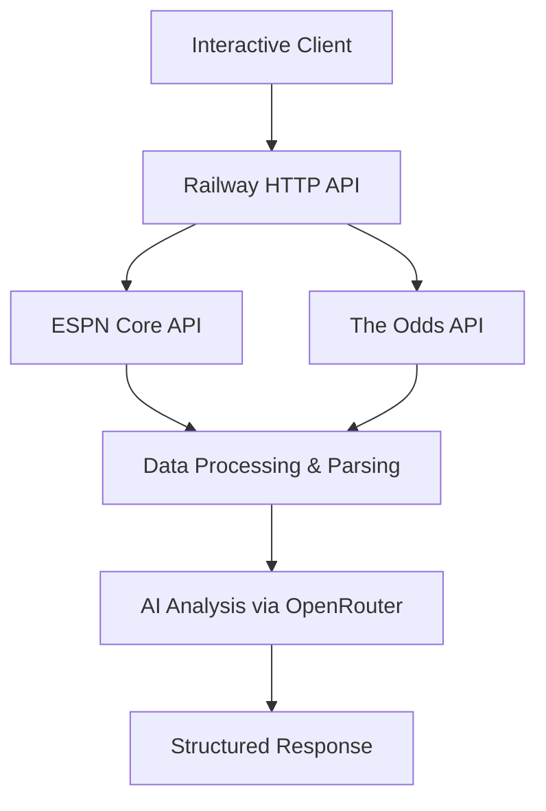

# Sports AI & Betting Intelligence Platform

A comprehensive sports data and betting intelligence platform built on **Railway Cloud** with **FastAPI**, providing real-time sports statistics, betting odds, player props, and AI-powered analysis.

## Platform Overview

This platform combines powerful sports data APIs with intelligent analysis:

### 🏈 **Core Sports Data Systems**
- **ESPN API Integration**: Live sports data from ESPN's comprehensive API
- **Odds & Betting Intelligence**: Real-time betting odds and player props via The Odds API  
- **Multi-League Support**: NBA, NFL, MLB, NHL, WNBA, College Basketball/Football, Soccer (Premier League, La Liga, MLS)
- **AI-Powered Analysis**: Natural language sports queries and game analysis via OpenRouter

### 🚀 **HTTP API Architecture**
- **FastAPI HTTP Server**: High-performance async REST API deployed on Railway
- **Embedded MCP Integration**: Sports AI and Wagyu Odds functionality integrated directly
- **Interactive Testing Client**: Comprehensive CLI interface for testing all features

### ☁️ **Deployment & Infrastructure**
- **Railway Cloud Deployment**: Automatic Python/FastAPI deployment with health checks
- **Environment Management**: Secure API key and configuration management
- **CORS & Authentication**: Production-ready security headers and API key auth

## Technical Architecture

### Sports Data Processing Pipeline



**Current Implementation:**
- Client: `interactive_sports_test.py` (HTTP requests)
- Server: `sports_http_server.py` (FastAPI on Railway)
- URL: `https://web-production-b939f.up.railway.app`

## Key Technologies & Dependencies

### Backend Technologies
- **Python 3.11+**: Core runtime environment
- **FastAPI**: High-performance async web framework with built-in validation
- **Railway**: Cloud deployment platform with automatic CI/CD
- **HTTP Client Architecture**: Direct REST API communication

### Data & AI Services
- **ESPN Core API**: Sports statistics and game data
- **The Odds API**: Real-time betting odds and player props
- **OpenRouter API**: Multi-model AI analysis (GPT-4, Claude, etc.)
- **pytz**: Timezone handling for Eastern time conversion

### Development & Testing
- **httpx**: Modern async HTTP client
- **Pydantic**: Data validation and serialization
- **Interactive CLI**: Comprehensive testing interface

## Project Structure

```
sports/
├── adapters/                    # Sport-specific data adapters
├── clients/                     # CLI clients and test utilities
├── daily_betting_intelligence/  # Comprehensive betting analysis system
├── sports_mcp/                 # MCP server implementations (embedded)
│   ├── wagyu_sports/          # Betting odds integration
│   ├── mcp_rest_api/          # Generic REST API utilities
│   └── sports_ai_mcp.py       # ESPN data integration
├── test/                      # Comprehensive test suite with real API data
├── interactive_sports_test.py # Main testing client
├── railway.json               # Railway deployment configuration
├── requirements.txt           # Python dependencies
└── sports_http_server.py      # Main FastAPI server (1,496 lines)
```

## Environment Configuration

### Required API Keys
```bash
# Core functionality
SPORTS_API_KEY=your_secure_api_key      # Authentication for HTTP endpoints
OPENROUTER_API_KEY=your_openrouter_key  # AI analysis and natural language processing

# Optional but recommended
ODDS_API_KEY=your_odds_api_key          # Real betting data (falls back to mock data)

# Deployment
PORT=8000                               # Railway auto-assigns this
SERVER_HOST=0.0.0.0                     # For Railway deployment
```

## Core Features & Capabilities

### 1. Sports Data Intelligence
- **Real-time Scoreboards**: Live game data across all major leagues with Eastern timezone conversion
- **Team & Player Statistics**: Comprehensive stats with season/game breakdowns using ESPN Core API
- **Game Summaries**: Detailed boxscores, play-by-play, and roster information
- **Advanced Analytics**: AI-powered game analysis and insights via OpenRouter

### 2. Betting Intelligence
- **Live Odds**: Real-time moneyline, spread, and totals across multiple sportsbooks
- **Player Props**: Individual player betting markets (points, rebounds, assists, etc.)
- **Multi-Sport Support**: Basketball, Football, Baseball, Hockey, Soccer markets
- **Today's Games Filtering**: Smart filtering to show only current day's games
- **Market Analysis**: Compare odds across different regions and bookmakers

### 3. Natural Language Interface
- **Query Understanding**: Process complex sports questions in plain English
- **Smart Parameter Mapping**: Extract relevant parameters from natural language
- **Contextual Responses**: Timezone-aware results with Eastern time conversion
- **Multi-Model AI**: Support for GPT-4, Claude, and other OpenRouter models

### 4. Interactive Testing Suite
- **Comprehensive CLI**: Full-featured menu-driven testing interface
- **Multi-League Navigation**: Easy switching between NBA, NFL, MLB, etc.
- **Player Props Search**: Progressive selection of games → players → specific props
- **API Call Tracking**: Monitor usage across different endpoints
- **Debug Information**: Detailed logging for development and troubleshooting

## Deployment Guide

### Railway Cloud Deployment (Current Production)

**Live URL**: `https://web-production-b939f.up.railway.app`

1. **Connect Repository**: Link your GitHub repository to Railway
2. **Automatic Detection**: Railway automatically detects Python/FastAPI configuration via `railway.json`
3. **Environment Setup**: Configure environment variables in Railway dashboard
4. **Deploy**: Railway handles build, deployment, and scaling automatically

The platform includes:
- Automatic health checks at `/health` endpoint  
- Graceful restart policies with up to 10 retries
- Horizontal and vertical scaling capabilities
- Built-in logging and monitoring

### Local Development

```bash
# Install dependencies
pip install -r requirements.txt

# Set up environment
cp .env.example .env.local
# Edit .env.local with your API keys

# Run HTTP server locally
python sports_http_server.py

# Test with interactive client
python interactive_sports_test.py
```

### Docker Deployment

```dockerfile
FROM python:3.11-slim
WORKDIR /app
COPY requirements.txt .
RUN pip install -r requirements.txt
COPY . .
EXPOSE 8000
CMD ["python", "sports_http_server.py"]
```

## API Reference

### Core Sports Endpoints
- `POST /espn/scoreboard` - Get live scoreboards for any league
- `POST /espn/teams` - Get team information and rosters  
- `POST /espn/game-summary` - Detailed game information and boxscores
- `POST /espn/player-stats` - Individual player statistics and game logs
- `POST /espn/team-stats` - Team statistics and records
- `POST /espn/analyze-game` - AI-powered game analysis

### Betting Intelligence Endpoints  
- `GET /odds/sports` - Available sports for betting
- `POST /odds/get-odds` - Live betting odds for games (filtered to today)
- `POST /odds/event-odds` - Specific event odds including player props
- `POST /odds/player-props` - Comprehensive player prop betting markets
- `GET /odds/quota` - API usage and quota information

### High-Level Orchestration
- `POST /ask` - Natural language sports queries with automatic tool discovery
- `POST /daily-intelligence` - Comprehensive daily sports summaries

### Health & Monitoring
- `GET /health` - Health check endpoint for Railway monitoring

## Current Implementation Status

### ✅ Fully Working
- **Railway Deployment**: Production-ready FastAPI server
- **ESPN Integration**: Complete sports data pipeline
- **Odds Integration**: Real-time betting data with fallback to mock data
- **Interactive Testing**: Comprehensive CLI testing interface
- **Multi-League Support**: NBA, WNBA, NFL, MLB, NHL, Soccer
- **Player Props**: Progressive selection and detailed market analysis
- **AI Analysis**: Natural language processing via OpenRouter
- **Timezone Handling**: Proper Eastern time conversion

### 🔧 Architecture Notes
- **No MCP Protocol**: Direct HTTP communication, no stdio/WebSocket MCP
- **Embedded Integration**: MCP-style functions imported directly into HTTP server
- **Single Server**: All functionality consolidated in `sports_http_server.py`
- **Client-Server**: Simple HTTP request/response pattern

## Testing & Usage

### Interactive Testing Client

Run the comprehensive testing interface:

```bash
python interactive_sports_test.py
```

Features:
- **Sport/League Selection**: Navigate through available leagues
- **Today's Games**: Live scoreboard data
- **Betting Markets**: Moneylines, spreads, totals
- **Player Props**: Detailed player betting markets
- **Statistics**: Team and player performance data
- **Daily Intelligence**: Comprehensive reports
- **API Monitoring**: Track usage and quota

### Sample API Usage

```python
import requests

# Get today's NBA games
response = requests.post(
    "https://web-production-b939f.up.railway.app/espn/scoreboard",
    headers={"Authorization": "Bearer YOUR_API_KEY"},
    json={"sport": "basketball", "league": "nba"}
)

# Get player props for a specific game
response = requests.post(
    "https://web-production-b939f.up.railway.app/odds/player-props",
    headers={"Authorization": "Bearer YOUR_API_KEY"},
    json={
        "sport": "basketball_nba",
        "player_markets": "player_points,player_rebounds,player_assists"
    }
)
```

## Security & Performance

### Security Features
- **API Key Authentication**: Secure token-based authentication for all endpoints
- **CORS Configuration**: Proper cross-origin resource sharing setup
- **Input Validation**: Comprehensive request validation with Pydantic models
- **Error Handling**: Structured error responses with debugging information

### Performance Optimizations
- **Async Architecture**: Non-blocking I/O throughout the entire stack
- **Connection Pooling**: Efficient HTTP client management with httpx
- **Smart Filtering**: Client-side and server-side filtering for today's games
- **Caching Strategies**: Intelligent caching for frequently accessed data
- **Error Recovery**: Graceful degradation and automatic retry mechanisms

## Development & Testing

### Code Organization
- **Single Server Architecture**: Consolidated FastAPI application
- **Type Safety**: Comprehensive Pydantic models and type hints
- **Error Handling**: Structured error responses with detailed debugging
- **Modular Functions**: Clear separation of ESPN, Odds, and AI functionality

### Development Workflow
1. **Local Development**: Direct HTTP server testing with real APIs
2. **Interactive Testing**: Comprehensive CLI interface for all features
3. **Railway Deployment**: Automatic deployment with environment management
4. **Production Monitoring**: Health checks and error tracking

## Future Enhancements

### Predictive Analytics Integration
- **Player Performance Correlation**: Connect ESPN stats with betting odds for prediction
- **Trend Analysis**: Historical performance vs. current betting lines  
- **AI-Powered Recommendations**: Machine learning models for bet analysis

### Enhanced Data Features
- **Real-time Updates**: WebSocket connections for live game updates
- **Historical Analysis**: Extended statistical analysis and trends
- **Additional Sports**: Tennis, UFC, Formula 1 integration
- **Advanced Visualization**: Interactive charts and data presentation

### Platform Improvements
- **Mobile Optimization**: Enhanced mobile API endpoints
- **User Accounts**: Personalized experiences and preferences
- **Webhook Integration**: Real-time notifications and third-party integrations
- **Performance Analytics**: Advanced monitoring and optimization

This platform provides a robust, production-ready sports intelligence system optimized for betting analysis and sports data correlation, deployed on Railway cloud infrastructure with comprehensive API coverage.